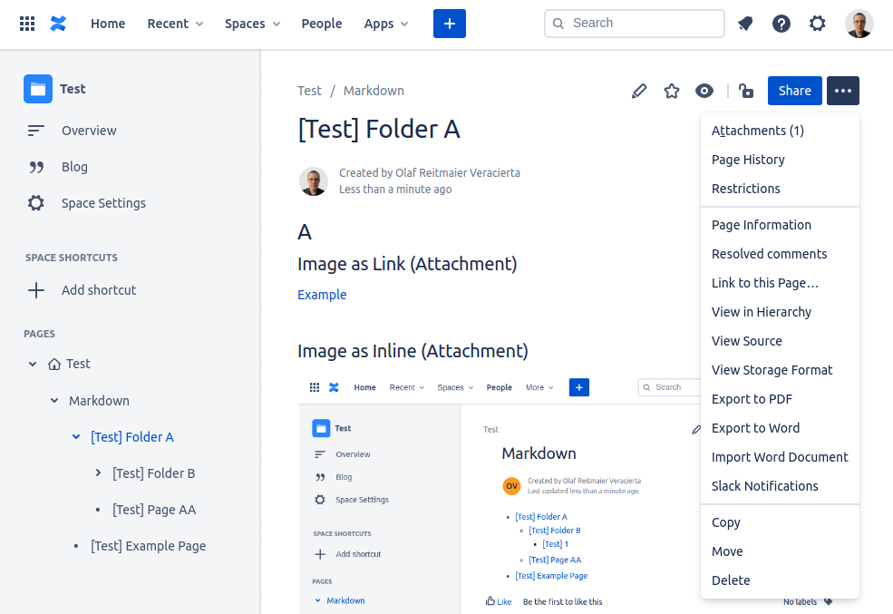

# Markdown to Confluence Publisher (mdtocf)

Markdown files/directory publishing to Atlassian Confluence.

## Prepare the Environment

```shell
git clone "https://github.com/olafrv/mdtocf.git"
./install.sh  # chmod +x install.sh
```

## Publish to Confluence

```shell
source venv/bin/activate
python3 -m mdtocf.mdtocf --help
python3 -m mdtocf.mdtocf \ 
    --confluenceUsername "olafrv@gmail.com" \
    --confluenceApiToken "****************" \
    --confluenceUrl "https://olafrv.atlassian.net" \
    --confluenceSpace "TEST" \
    --confluenceParentPageId "33114" \
    --confluencePageTitlePrefix "[Test] " \
    --markdownDir ./examples \
    --db ./examples/examples.db
deactivate
```

## Console Output

Output:
```shell
DEL => Id: 3409835, Title: [Test] Folder B
DEL => Id: 3409844, Title: [Test] 1
DEL => Id: 3409824, Title: [Test] Folder A
DEL => Id: 3409853, Title: [Test] Page AA
DEL => Id: att3409862, Title: example.png
DEL Att. => Title: example.png
DEL => Id: 3409867, Title: [Test] Example Page
UPD => Title: [Test] Folder A
Can't find '[Test] Folder A' page on the https://olafrv.atlassian.net/wiki!
IDX => Title: [Test] Folder B
Can't find '[Test] Folder B' page on the https://olafrv.atlassian.net/wiki!
UPD => Title: [Test] 1
Can't find '[Test] 1' page on the https://olafrv.atlassian.net/wiki!
UPD => Title: [Test] Page AA
Can't find '[Test] Page AA' page on the https://olafrv.atlassian.net/wiki!
UPD Att. => Title: example.png
UPD Att. => Title: example.png
UPD => Title: [Test] Example Page
Can't find '[Test] Example Page' page on the https://olafrv.atlassian.net/wiki!
```
The *"Can't find..."* means *"not found but creating..."* (Python Atlassian API).

## Results in Confluence

Rendering and publishing **./examples** produce the following final result in Confluence:




# About Markdown Compatibility

This scripts depends on [Mistune v2 Markdown Parser](https://mistune.readthedocs.io/en/latest/),
compatible with [CommonMark](https://spec.commonmark.org)

The (optional) metadata heading in markdown (.md) files likes the one which 
follows below used by [Hugo](https://gohugo.io/getting-started/quick-start/), 
it is not part of CommonMarkdown standard, but just a popular way of specify 
in YAML markdown metadata usable for external tools.

```yaml
---
title: My Page Title
date: 2019-03-26T08:47:11+01:00
draft: true
chapter: true
kind: index
---
```

It is parsed and partially used by this script to organize the content in
Atlassian Confluence.

## Development

See [release.sh](./release.sh) for the development and release process.

# References

## Python v3

* https://docs.python.org/3/
* https://docs.python.org/3/howto/regex.html
* https://packaging.python.org/tutorials/packaging-projects/
* https://pip.pypa.io/en/stable/reference/pip_install/#git
* https://pip.pypa.io/en/latest/reference/pip_install/#requirements-file-format
* https://packaging.python.org/discussions/install-requires-vs-requirements/

## Markdown

* https://spec.commonmark.org
* https://spec.commonmark.org/dingus/
* https://github.com/lepture/mistune
* https://mistune.readthedocs.io/en/latest/

## Confluence and Storage Format (Cloud API)

* https://pypi.org/project/atlassian-python-api/
* https://atlassian-python-api.readthedocs.io/confluence.html
* https://developer.atlassian.com/cloud/confluence/rest/
* https://confluence.atlassian.com/doc/confluence-storage-format-790796544.html
* https://confluence.atlassian.com/doc/macros-139387.html
* https://confluence.atlassian.com/conf59/code-block-macro-792499083.html
* https://confluence.atlassian.com/confkb/how-to-get-confluence-page-id-648380445.html
* https://confluence.atlassian.com/doc/delete-or-restore-a-page-139429.html
